# BlockGamut

English · [简体中文](README.zh-CN.md)

[Open the explorer](https://ticoch1.github.io/BlockGamut/) · [Source](https://github.com/TicoCh1/BlockGamut)

BlockGamut is an interactive Minecraft Java block colour and material atlas. It places textured, native-size block models in three-dimensional colour spaces so builders can compare palettes, find neighbouring materials, inspect texture variation and explore how block appearances changed between releases.

It runs entirely in the browser. No Minecraft installation, account, backend or uploaded world is needed. English is the default; Simplified Chinese is also available.

Created by [TicoCh1](https://github.com/TicoCh1). Minecraft textures © Mojang / Microsoft.

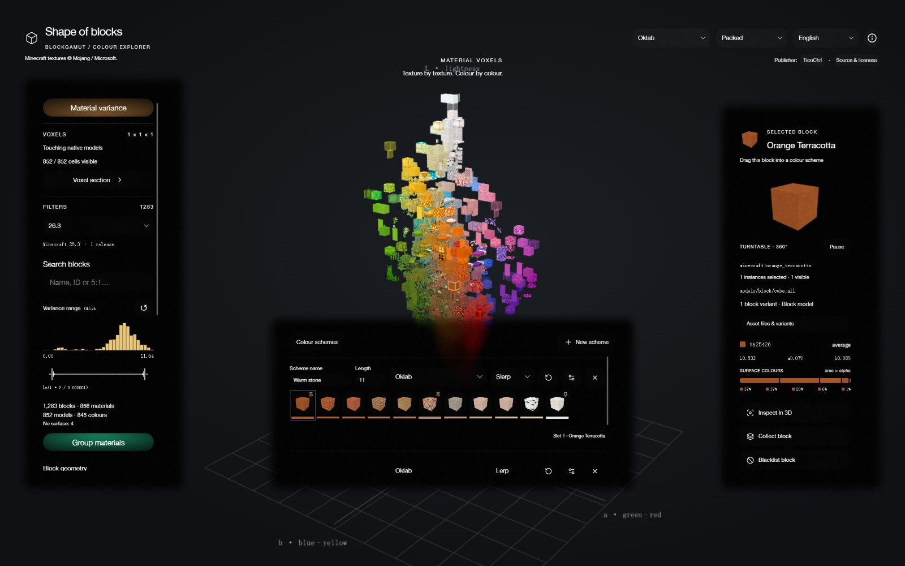

## Explore eight colour spaces

Choose **Coordinate space** in the upper-right header, beside **Arrangement** and the language selector, to compare perceptual lightness, RGB channels or hue-based relationships. Every view uses the same selected release's materials and preserves the numerical colour values shown in the inspector.

| Oklab | sRGB |
| --- | --- |
|  |  |
| **Linear RGB** | **HSV** |
|  |  |
| **HSL cylinder** | **HSL bicone** |
|  |  |
| **CIE XYZ · D65** | **CIELAB · D65** |
|  |  |

### Material variance

Enable **Material variance** in any colour space to compare texture variation instead of average colour. Statistics use **six 16×16 material planes (1,536 pixels)** derived from the original unlit UV regions. Small regions repeat to fill the plane; larger regions use BOX downsampling. Unique regions in each direction share one plane, and missing directions repeat available material planes. Transparency contributes no colour weight. Model size, face area and duplicate geometry do not increase statistical weight. The displayed textures and native model dimensions keep their original appearance. The axes use fixed logarithmic scales, including a finite floor for zero; inspector values remain the original, unscaled population variances. Hue variance uses shortest-arc distances and excludes achromatic pixels.


Stained glass and stained-glass panes use **source-over composited colours against a pure-white reference background, `#FFFFFF`**, before calculating variance. Every resulting pixel has equal weight, including the background visible through transparent pixels. This captures opacity patterns even when the original texture RGB is uniform; alpha is applied once during compositing.

White glass correctly has zero variance on this white reference background.

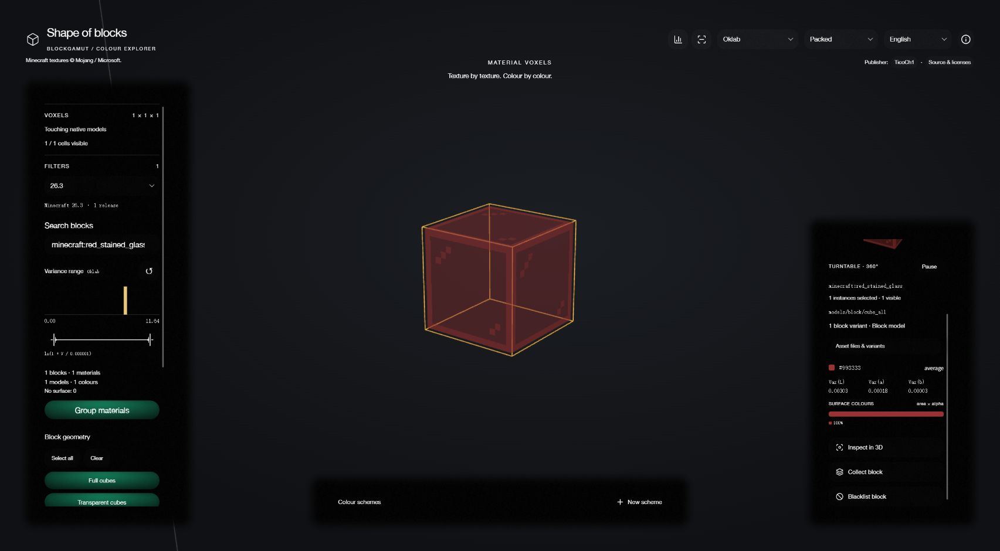

## Choose a block arrangement

Use **Arrangement** in the upper-right header.

- **Spaced** leaves at least one block of clearance between native models.
- **Packed** places models on a lattice while reserving their actual footprint.
- **Dense fill** reserves a cell for each displayed material and fills other in-gamut cells with the nearest material. Repeated instances share selection.

Changes use simultaneous Manhattan movement. Dense transitions move representative blocks and fade the repeated fill. Reduced-motion preferences disable movement and start the turntable paused.

| Spaced | Packed | Dense fill |
| --- | --- | --- |
|  |  |  |

Collision handling can move blocks away from their exact mathematical colour coordinates. Use the inspector for precise numerical comparisons.

## Open a voxel section

In Packed or Dense fill, **Voxel section** opens a movable window with a textured two-dimensional cross-section. Choose an axis and position, keep a cutaway volume or a single voxel layer, and reverse the retained side. Hue-angle and radius sections are available in hue-based colour spaces when variance is off.

Drag the window by its header, or focus the drag handle and use arrow keys; Shift makes one-pixel adjustments. The position slider updates the slice and 3D section while dragging. Clicking a slice tile selects every instance of that block.

| Cutaway volume | Reversed side |
| --- | --- |
| 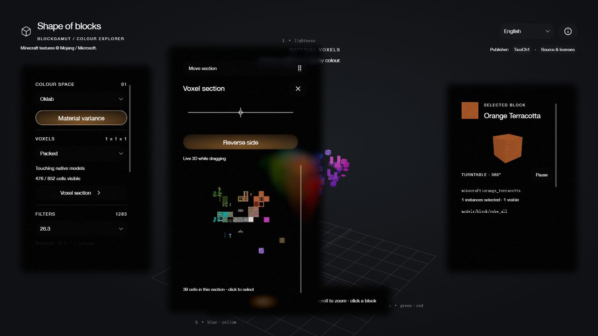 |  |
| **Single voxel layer** | **Hue-angle section** |
|  |  |


## Filter materials and historical releases

The **Filters** area combines Minecraft version, search, variance range, geometry class, colour source, material grouping, opacity and biome-tint inclusion.

The bundled dataset covers **84 Java release entries from 1.7.2 to 26.3** in Mojang's official version manifest; snapshot entries are excluded. Releases without changes to the represented materials share **31 groups**, labelled with the earliest release and a `+` when applicable. For example, **1.7.2+** covers 1.7.2–1.7.10; the filter shows the full range. The latest bundled release is selected initially. Future releases require a dataset update.

Switching a release changes its available blocks, original textures, models, colours and animations together. Old versions use their old materials. The large default [Texture Update arrived in Java 1.14](https://www.minecraft.net/en-us/article/village---pillage-out-java-).


**Group materials** merges identical resolved texture sets and tints, preferring a full cube when available. Similar colours alone do not merge blocks. Disable grouping to include individual variants. Block geometry is a multi-select filter: Full cubes, Transparent cubes, Flat planes, Entity, Oversized, Sets and Other. Selected categories form a union; clearing them shows no blocks. Glass and other cubes with transparent surfaces are separated from solid Full cubes. Multipart mushroom shells remain full cubes. Beds include both original head and foot models and belong to Oversized. Sets is a subset of solid Full cubes with a matching slab/stair family in the selected release, including wood planks/logs and stone-brick families. **Colour source** can use the model average or any of its six faces.

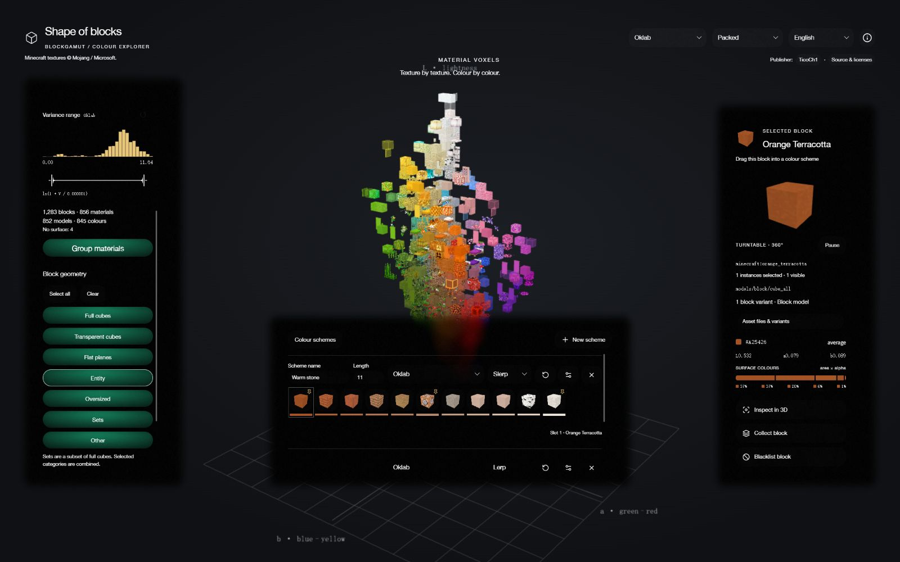

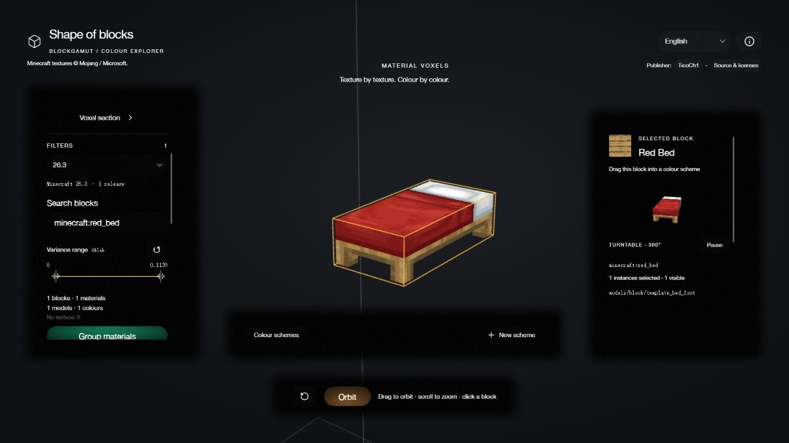

### Search, selection and empty results

Search accepts English or Chinese block names, namespaced IDs and legacy numeric IDs such as `5:1`. Click a block in the scene to select it. A filter combination with no results, or a state with no selected block, displays **minecraft:air** in the inspector. **Reset filters** is available when the result is empty.

| Legacy ID search and selected result | Empty result |
| --- | --- |
|  |  |

The controls stay visible. The separate block-library entry and its former top-right controls are intentionally hidden.

### Variance range

The **Variance range** filter sums the three channel population variances of the **currently selected colour space**. For Oklab this is `Var(L) + Var(a) + Var(b)`; for sRGB it is `Var(R) + Var(G) + Var(B)`. Its label, values and range change with the colour space, with separate bounds remembered for each space during the page session. The filter and variance axes use the same standardized 1,536-pixel material statistics. It works in average-colour and material-variance views, independently of the face selector. Both endpoints are inclusive.

Two instances of the original FORM `<|>` slider thumb share one logarithmic track, including its curved lobes and velocity-driven deformation. The endpoint readouts show `ln(1 + V / 0.000001)` to avoid scientific notation while keeping zero defined. A histogram above the track uses the same log axis: bar height counts blocks passing the other filters, and the selected interval is highlighted. Changing the colour space or other filters updates the distribution; moving the variance handles keeps the full distribution visible. Drag and release to apply; arrow keys adjust a handle, Page Up/Down move farther, and Home/End move to a limit. The handles cannot cross and remain separately reachable when they meet. The reset arrow restores the complete range.

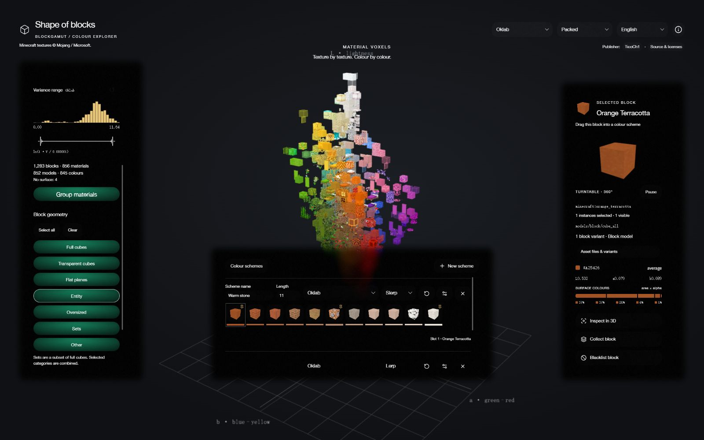

## Manage colour schemes

Use **New scheme** on the lower centre bar. Each horizontal row is one scheme, with its own name, integer length (at least **3**), colour space, interpolation and filters. Edit the name, length, colour space and **Lerp / Slerp** directly on the row. The settings icon opens only block filters and variance filters. New schemes inherit the current geometry selection and colour space, then remain independent of the explorer controls. The selected Minecraft release supplies every scheme's materials.

Drag the selected block's **title or model thumbnail in the right inspector** into a slot. Every filled slot, including generated materials, is draggable. Click a block to **pin** it; click again to **unpin** it. Drag within a row to reorder; the pin moves with its block. Drag into another row to move it there. Drag out of all rows and release to remove it, leaving an empty slot without changing the configured length. A model copy follows the pointer, destination slots highlight, and Escape cancels.

Use the row's **refresh arrow** to fill unpinned slots with the current colour space, interpolation and filters. Pinned blocks remain exact. Edits stay visible until refresh; when there are no pins, refresh uses the first and last remaining blocks as temporary endpoints. Incoming inspector blocks start unpinned. Clicking a slot also displays its actual block in the inspector, including blocks outside the explorer filters.

Unpinned slots interpolate between neighbouring control points in the scheme's colour space, then match the nearest eligible material in that space. **Lerp** is the default: it blends channel values linearly, using the shortest hue arc in HSV/HSL and chroma in HSL bicone. **Slerp** follows the shortest spherical arc in the atlas's fixed coordinate metric, around that space's black origin, while blending distance from black linearly. Hue spaces use their cylinder or bicone geometry. Output colours are clipped to valid channel/RGB bounds. Exact control points remain unchanged in either mode. Outside the outermost control points the endpoint colour is held. The thin swatch below each cell shows the target colour; the thumbnail shows a three-dimensional preview of the matched Minecraft block. Technical blocks such as `minecraft:test_block` retain their original appearance and are identified by name and ID. With no eligible material, an interpolated slot stays empty. Control points retain their exact block IDs even when excluded by that scheme's filters or unavailable in another release.

**Scheme filters** contains geometry categories, search, collection/blacklist choice, variance range, opacity and biome tint inclusion. Variance bounds are remembered separately for each scheme's colour spaces. Resizing distributes control points proportionally across the new integer slots; if several land on one slot, the later point is retained. Rename, remove, collapse or add schemes as needed. Schemes are saved in this browser and survive reloads; collection and blacklist entries remain session-based.

On narrow screens, the lower bar opens the scheme manager in a scrollable glass dialog, keeping the inspector accessible when the dialog is closed. A draggable copy of the currently selected block is available at the top. The same tap-to-pin, drag and refresh controls work in that dialog; Enter or Space toggles a focused slot’s pin.

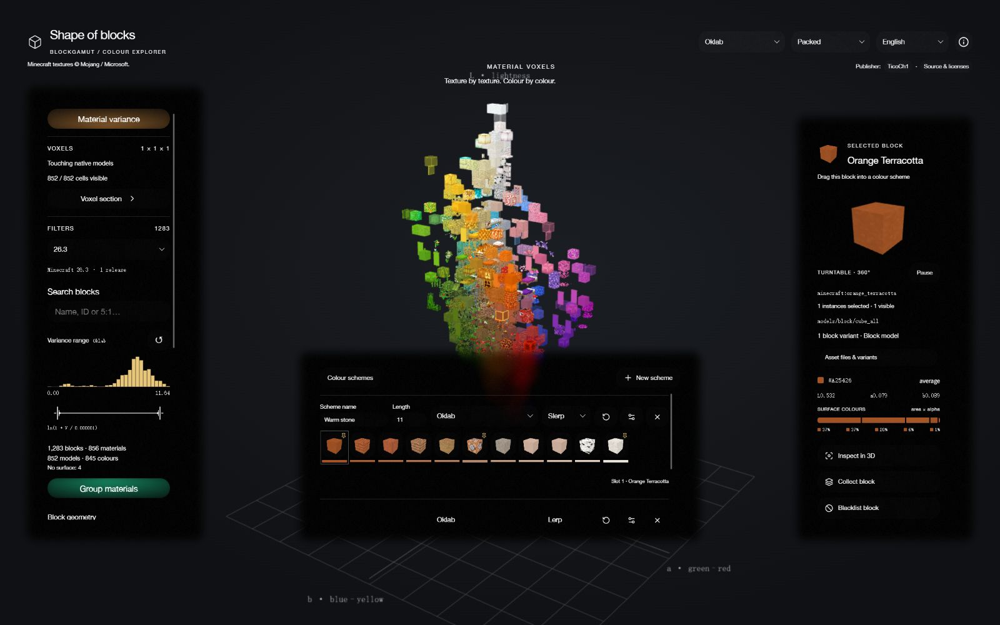

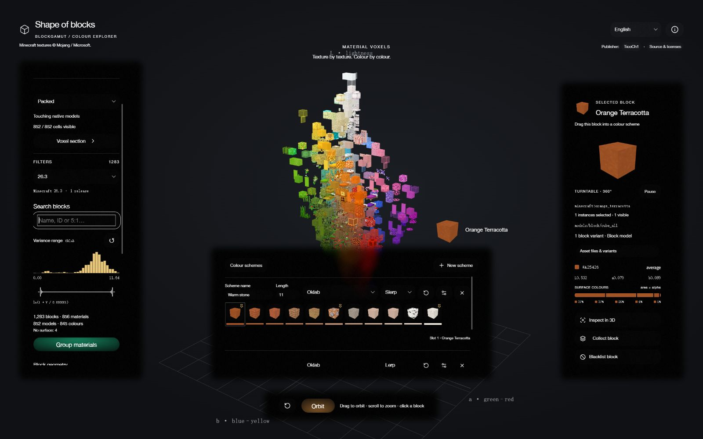

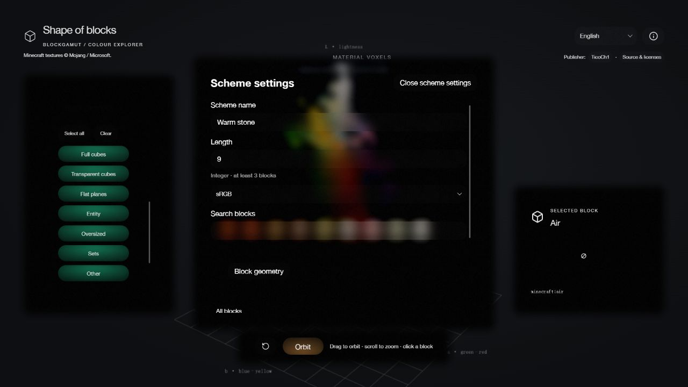

## Inspect native models and build a collection

The inspector contains a rotating model preview, block ID, source files and variants, sampled colour, coordinates or variances, and a five-colour surface summary. Pause or resume the turntable, and choose **Inspect in 3D** to move the camera close to the selected block.

Models retain their native dimensions and alpha. Previews include non-cubes, crossed plant planes, multipart models, tall plants and static representations of special block renderers. Vanilla texture frame sequences, timing and interpolation are retained; end portals use an animated layered preview.

| Asset files and surface statistics | Native chest preview |
| --- | --- |
|  |  |


Use **Collect block** in the inspector, then select **My collection** in the Block list filter to view your chosen palette. Collections last for the current page session and reset on reload.


### Blacklist

Choose **Blacklist block** in the inspector to hide a block from the normal atlas and from **My collection**. With material grouping enabled, the action includes all variants of the displayed material, so another equivalent variant does not immediately replace it. Entries are excluded before material grouping and combine with the other filters.

Select **My blacklist** in the Block list filter to view excluded blocks. Select one and choose **Remove from blacklist** to restore it. Search and variance filters still apply in this view; use **Reset filters** if the current combination hides an entry. Resetting filters does not clear the blacklist. Like the collection, the blacklist lasts for the current page session and resets on reload.


## Camera, language and layout

Drag the scene to orbit and scroll to zoom. The bottom camera toolbar has been removed; the selected block retains its separate rotating preview. The language selector switches between English and Simplified Chinese and remembers the selection on that browser.

Panels adapt to the viewport and reserve space for their feathered edges. Longer content uses themed scrollbars inside each panel. Dropdowns, resource disclosures and the information dialog share the same glass material and sequential disappear → shell motion → appear transitions. The section window supports pointer dragging and arrow-key movement, stays within the viewport and preserves live section preview while its position slider is dragged. Escape closes the information dialog and returns focus to its trigger.

| Simplified Chinese | Data and method notes |
| --- | --- |
|  | 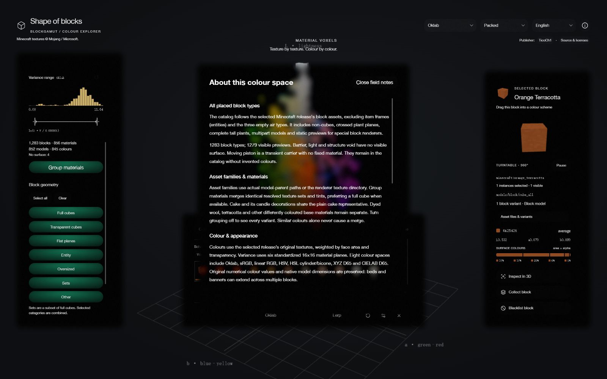 |

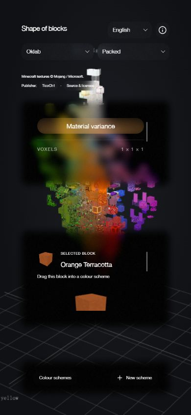


## Data and limitations

Release assets are incremental: original texture pixels are stored once in a shared atlas, and each material group records changed catalog entries, models and animation metadata against its predecessor. The bundled version assets contain 3,602 unique texture tiles in eight atlas pages. Unchanged releases do not carry a complete copy of the textures. The runtime caches reconstructed release data.

Colour and variance statistics describe the source texture pixels rather than in-game lighting. The five-colour summary is only a visual summary, not the input to variance calculations. One representative placed state is shown per block. Special renderers use closed/rest poses, default skins and plain banners or pots. World lighting, particles, moving block entities and custom block data are not reproduced. Invisible blocks remain in the catalog without invented surface colours; air types and item frames are excluded from the placed-block atlas.

A modern browser with WebGL is required for the 3D scene. Dense fill can be substantially more expensive than Packed, especially in large RGB gamuts.

## Run locally

Use **Node.js 22 or later** and npm:

```sh
npm ci
npm run dev
```

Open `http://127.0.0.1:5190/`. For a production build and local preview:

```sh
npm run build
npm run preview
```

The preview runs at `http://127.0.0.1:4190/`. The build writes the static website to `dist/`.

## Static deployment

Vite uses relative asset paths, so the generated site can be served from a repository subdirectory. No server API is required. The [GitHub Pages workflow](.github/workflows/pages.yml) installs the locked dependencies, builds the website and publishes `dist/` when changes reach `main`.

For a fork, select **GitHub Actions** as the repository's Pages source. Other static hosts can serve the contents of `dist/` unchanged.

The public repository contains application code, runtime assets, build support, licenses and this illustrated README. Local development notes, private configuration, credentials, caches and generated build output are excluded.

## Licensing

BlockGamut's original application code and documentation are licensed under **GPL-3.0-or-later**, a copyleft license; see [LICENSE](LICENSE). Third-party components retain their supplied terms and notices in [THIRD_PARTY_NOTICES.md](THIRD_PARTY_NOTICES.md) and [licenses/](licenses/).

Minecraft textures, models and related assets © Mojang / Microsoft. See [Minecraft asset copyright](licenses/MINECRAFT-ASSETS.md).

Oklab conversion and legacy-ID source attributions are retained in their source files and third-party notices. ShapeOfColour inspired the interaction and layout.
